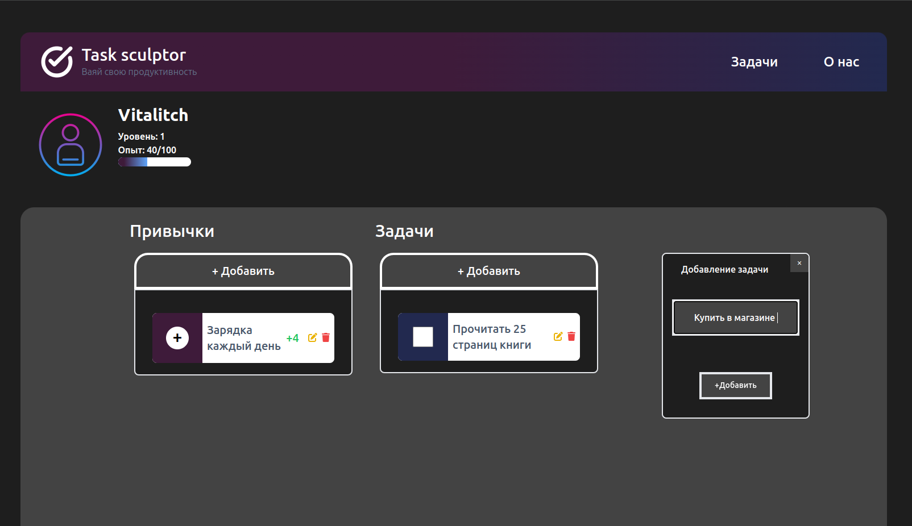

# 🧠 To-Do проект на Laravel + Vue.js + Inertia.js

Интерактивное SPA-приложение в виде To-do листа с **системой прокачки опыта**

---
## Превью


## Стек технологий

- **Laravel 10** — Бэкенд API и бизнес-логика
- **Vue.js 3** — Фронтенд компонентовое приложение
- **Inertia.js** — Мост между Laravel и Vue
- **TailwindCSS** — Ультрабыстрая адаптивная верстка
- **Vuex** — Управление состоянием (XP, задачи, прогресс)

---
## Возможности

- Создание, редактирование и удаление задач
- Система опыта (XP) — получай баллы за выполнение задач
- Отображение уровня и прогресса
- Хранение задач в базе данных
- SPA-опыт без перезагрузки страницы

---
## Установка проекта
```bash
git clone https://github.com/Vital1tch/laravel-vue-todo-xp
cd laravel-vue-todo-xp

# Установить зависимости PHP
composer install

# Установить зависимости JS
npm install && npm run dev

# Настроить .env
cp .env .env
php artisan key:generate

# Настроить базу данных
php artisan migrate

# Запустить сервер
php artisan serve
```


